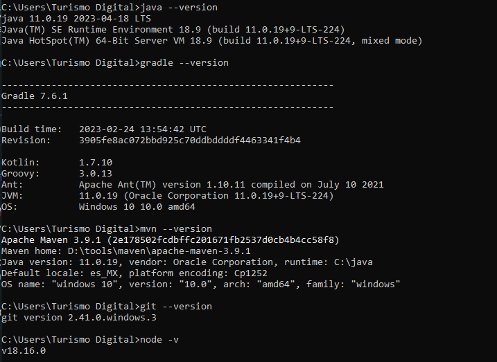

## Instruccions 

To install karate and Serenity, follow the steps below:
1 Install IntelliJ IDEA 2023.1.4 (Community Edition), or failing that VSC, https://www.jetbrains.com/es-es/idea/download/?section=windows.

2. Install Jdk jdk-11.0.2_windows-x64_bin
3. Install Gradle 7.6.1 https://gradle.org/releases/
4. Install Maven https://maven.apache.org/download.cgi.
5. Install Git https://git-scm.com/ (these help us to control versions).
6. Install node https://nodejs.org/es
7. Configure global variables, you must add them in Edit Environment Variables
8. Install Cucumber Plugins for Java.
9. Clone, Fork the following repository
   https://github.com/serenity-bdd/serenity-junit-screenplay-starter, this repository contains the SerenityJjunit Screenplay base
10. For the purpose of this Challenge, I attach the task https://github.com/JRafacand/nttdata11
11. You can follow me at https://github.com/JRafacand
## Executing the tests
To run the sample project, you can either just run the `CucumberTestSuite` test runner class, or run either `mvn verify` or `gradle test` from the command line.

By default, the tests will run using Chrome. You can run them in Firefox by overriding the `driver` system property, e.g.
```json
$ mvn clean verify -Ddriver=chrome
```
Or
```json
$ gradle clean test -Pdriver=chrome
```


